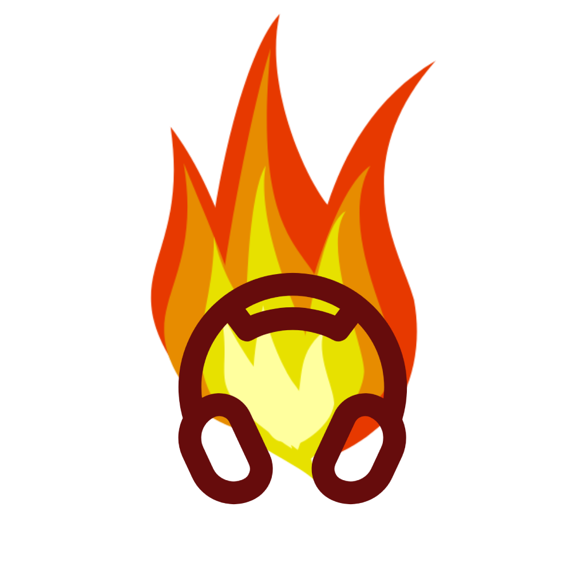
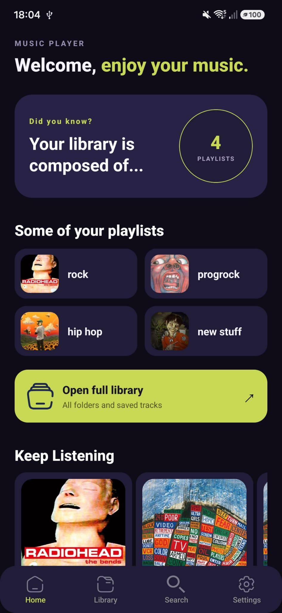

    
    <h1 style="font-weight: bold; font-size: 3em" >Music Player</h1>
    
Android Music Player built with React Native and Expo.

    

        
        
        
        
    

    

        
    

    <h2 style="font-size: 2em">Features</h2>
    <ul>
        <li>🔍 Autoscan of Android MediaStore.Audio</li>
        <li>🚀 Tracks caching for fast retrivial</li>
        <li>📁 Folders as Playlists</li>
        <li>🛜 Offline Play</li>
        <li>🛃 Notification media control</li>
        <li>🔬 Search functionality</li>
        <li>💪 Written in TypeScript</li>
        <li>⏩ New Architecture and Nitro Modules</li>
    </ul>

    <h2>🤝 Contributing</h2>
    <ul>
        <li>Forks are welcome.</li>
        <li>Bug reportings and suggestions are welcome.</li>
        <li>PRs are welcome.</li>
    </ul>

    <h2>📜 License</h2>
    
This project is licensed under GPL-3.0.

